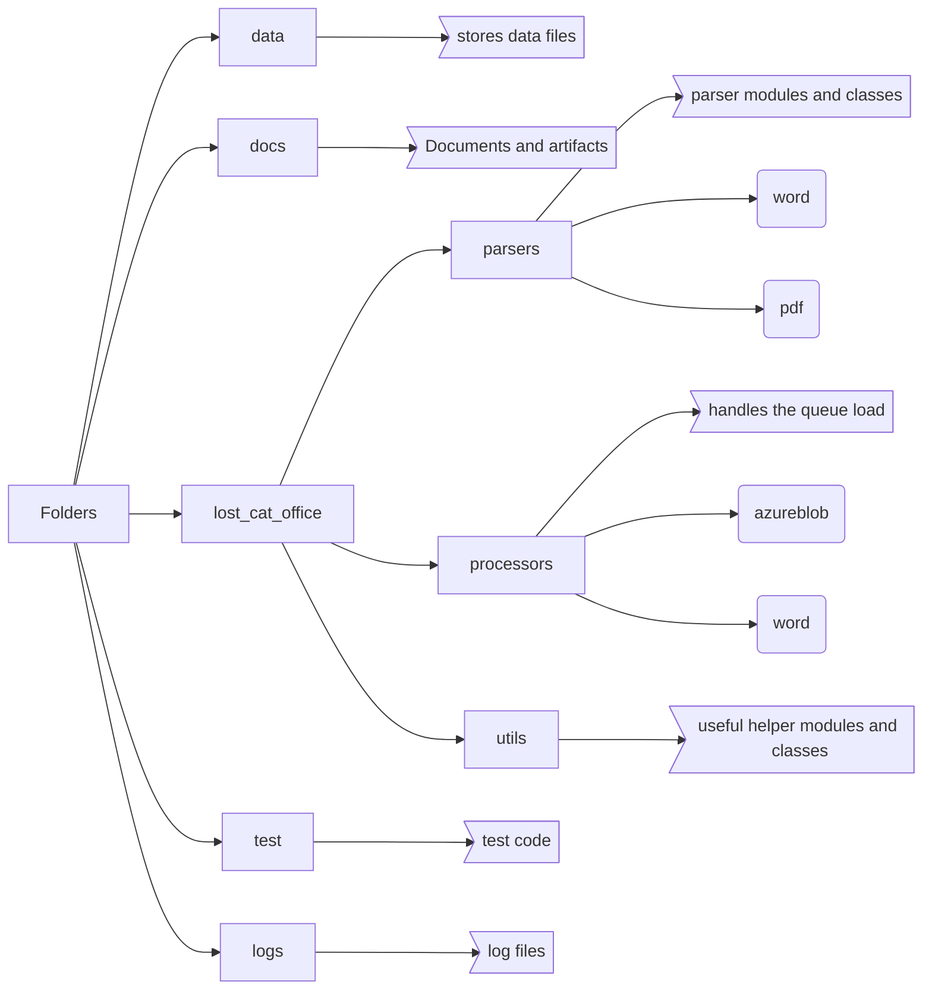

# lost_cat_office
A repository for the core office processors and parsers

```mermaid
graph LR;
   A[Folders] --> B[data]
   A --> C[docs]
   A --> F[lost_cat_office]
   A --> E[test]
   A --> J[logs]
   B --> BT>stores data files]
   C --> CT>Documents and artifacts]
   F --> G[parsers]
   G --> GT>parser modules and classes]
   G --> GW(word)
   G --> GP(pdf)
   F --> H[processors]
   H --> HT>handles the queue load]
   H --> HA(azureblob)
   H --> HW(word)
   F --> I[utils]
   I --> IT>useful helper modules and classes]
   E --> ET>test code]
   J --> JT>log files]
```